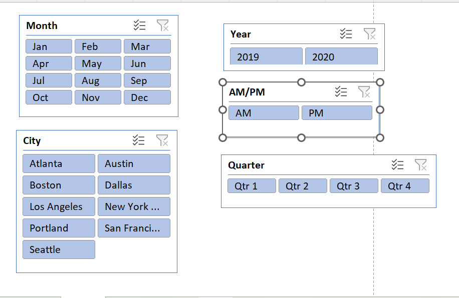
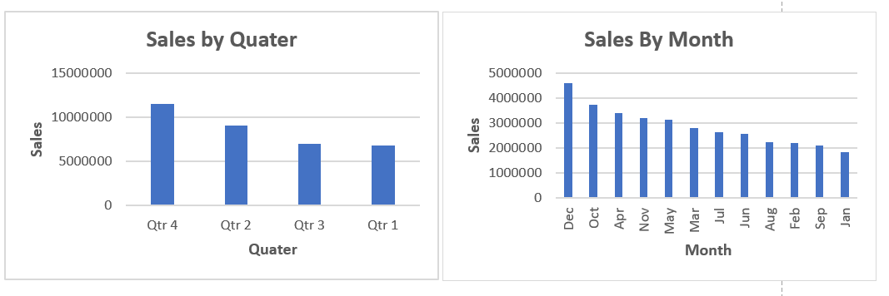
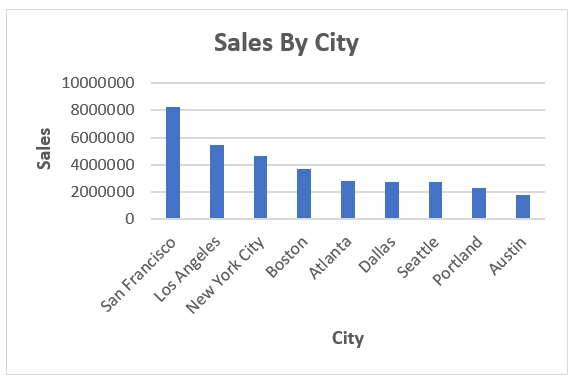
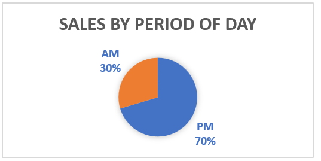
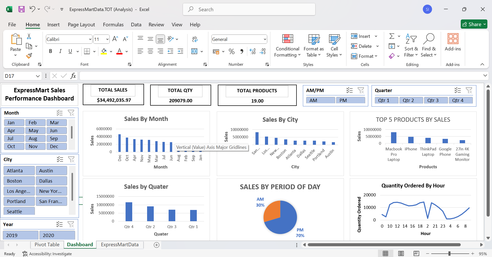

# 🛒 ExpressMart Sales Performance Dashboard

## 📌 Project Overview
ExpressMart operates across major US cities, but the management team needed to look past raw numbers to understand how customers actually buy. I built a dynamic Excel dashboard to analyze $34.49M in sales, pinpoint peak hours, isolate top products, and track regional trends. This data provides the retail operations team with concrete evidence to optimize staffing schedules, inventory levels, and regional marketing budgets.

## 🛠️ Tools Used
* **Power Query:** For data cleaning, modeling, and dashboard construction, `my_query.m` [view here](Power_query/my_query.m)
* **Pivot Table:** To engineer real-time KPIs like total Sales, quantities sold, and time-of-day distributions.

  

---

## 🎛️ Interactive Dashboard Slicers
Cross-filtering slicers are connected across all report pages via global data relationships.

* **Temporal Slicers:** `Year` (2019-2020) and `Month` buttons isolate seasonal trends.
* **Regional Slicers:** `City` multi-select buttons isolate specific state operations.
* **Daypart Slicers:** `AM/PM` and `Quarter` blocks track shift-based performance.
* **Report Connections:** All slicers link to backend tables for synchronized charts.

---

## 📊 Core Dashboard Metrics
* **Total Sales:** $34,492,035.97
* **Total Items Sold:** 209,079 units
* **Product Catalog:** 19 unique product lines

## 💡 Key Analytical Insights

### 1. Seasonal Trends
Sales peak dramatically during the holiday season. 

* **Top Quarter:** Qtr 4 dominates sales.
* **Top Month:** December brings peak revenue.
* **Lowest Month:** January marks the sharpest dip.
* **Action:** Increase marketing budgets by late September.

 

### 2. Regional Performance
Revenue concentrates heavily within coastal urban tech hubs.

* **Top City:** San Francisco leads all regions.
* **Runners Up:** Los Angeles and New York.
* **Weakest Hubs:** Austin, Portland, and Seattle.
* **Action:** Reallocate marketing funds to the West Coast.

 

### 3. Customer Buying Behavior
Order volumes depend heavily on time of day.

* **Daypart Split:** 70% of transactions happen post-noon.
* **Midday Peak:** Orders spike from 11 AM–12 PM.
* **Evening Peak:** Peak shopping occurs from 6 PM–7 PM.
* **Action:** Align customer support shifts with peak hours.

 

---

## 📋 Strategic Recommendations

* **Staffing:** Increase team sizes during evening shopping peaks.
* **Inventory:** Hedge inventory for Macbooks before Qtr 4.
* **Marketing:** Run localized product bundles in San Francisco.

---
## Final Dashboard

You can also view the PDF of the Excel file , `ExpressMartData.TOT (Dashboard).pdf`. [here](pdf%20reports/ExpressMartData.TOT%20(Dashboard).pdf).

---
## Files Included
- `ExpressMartData.TOT (Worked).xlsb`:[Cleaned Excel file.](datasets/ExpressMartData.TOT%20(Worked).xlsb).

- `ExpressMartData.TOT.xlsx`: [Raw excel data from Express mart.](datasets/ExpressMartData.TOT.xlsx).

---

*Thanks for checking out my excel project! Feel free to connect or drop any suggestions on my layout!*
*please contact via LinkedIn [Sadat Ibrahim](https://www.linkedin.com/in/sadat-gh)*
